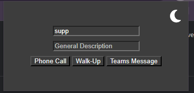

# ServiceDeskExtension

### **Installation Instructions**

1. Clone the repository to your local machine.
2. Open Chrome and navigate to `chrome://extensions`.
3. Enable Developer Mode by clicking the toggle switch in the top right corner.
4. Click the "Load unpacked" button and select the NewTab folder inside of the cloned repository folder.
5. Once loaded, you will need to refresh the service page.
6. The extension should now be loaded and ready to use.
   

# **What does this Do?**

### **Extension Pop-Up**

If you click on the extension icon a new menu wil show allowing you to quickly create quickcall tickets ie. Phone Call, Walk up, and Teams Message.

_Extension Pop-Up in Dark Mode, click moon/sun to switch_

1. Simply search in the top text box for the user and select in the result box that shows when searching
2. Create a general description (this is what you enter after "Phone Call - " in the subject line)
3. Click on which quickcall you would like this ticket to be created as
4. Once successfully created a confirmation message will appear that links to the newly created ticket, window will close after 3 seconds

- A button will appear next to the user input felid when you select a user from the results that copies the username to the clipboard

### **Requests list i.e. Incident and My Tasks**

- Changes all request links to open in new tab
- Alternates background color of request list item for easier readability
- Automatically closes confirmation of ticket creation after a delay of 300 milliseconds

### **Request Page**

- New Save And Close button option that will save and close after a delay of 1 second
- Change title of tab to be the subject title
- Change Description box to be resizable
- Opens Notes section if notes are in request
   

### **If you run into any issues please let me know!**

   
   
   

_"The greatest extension not in the app store - wmed employee" - Richard Graziano_
